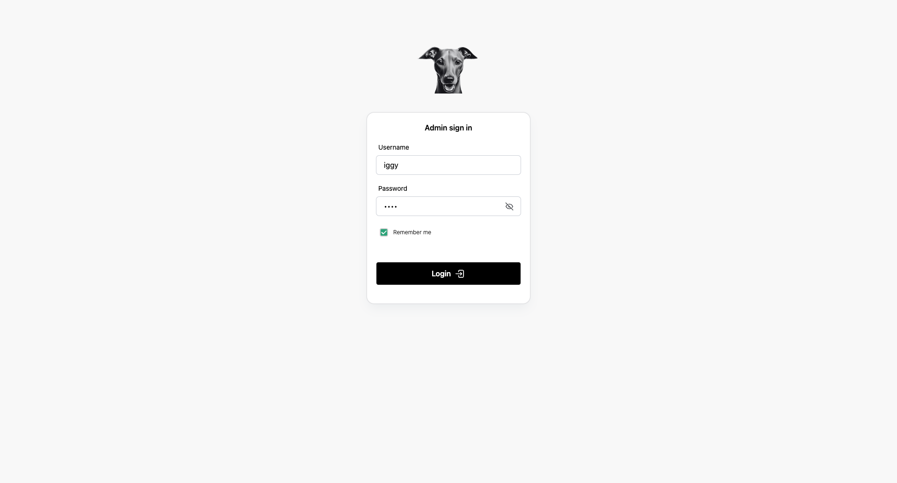
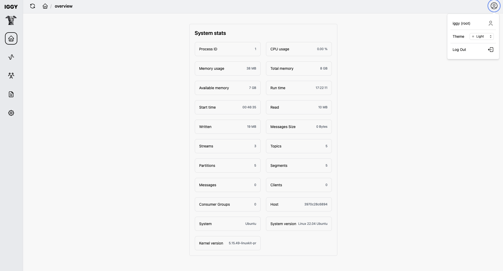
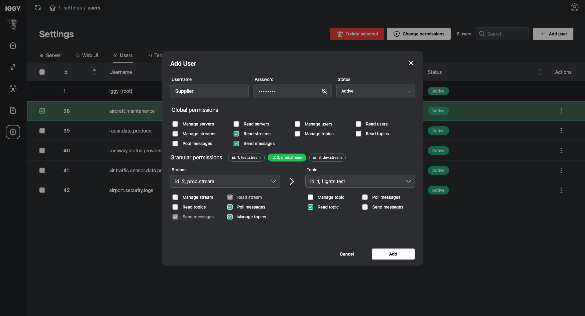
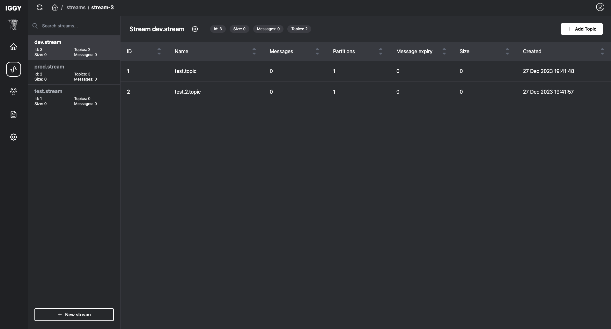
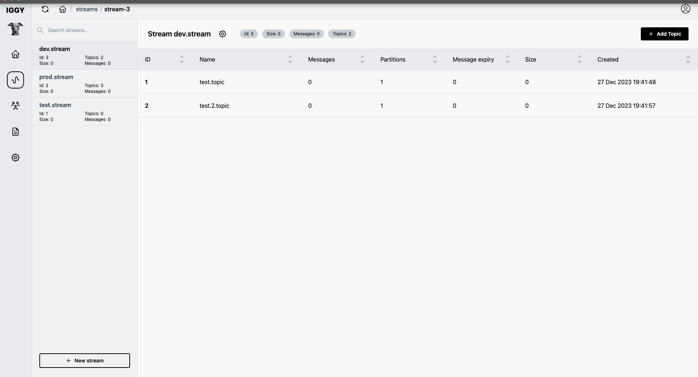

# Iggy Web UI

This repository hosts the web user interface for [Iggy](https://github.com/spetz/iggy), a persistent message streaming platform written in Rust. The web UI is built using SvelteKit.







## Overview

The Iggy Web UI provides a user-friendly panel for managing various aspects of the Iggy platform, including streams, topics, partitions, and more.

### Getting Started

1. **Clone the repository:**

   ```sh
   git clone https://github.com/iggy-rs/iggy-web-ui.git
   ```

2. **Build the project:**

   ```sh
   cd iggy-web-ui
   npm install
   ```

3. **Run the project:**
   ```sh
   npm run dev
   ```

## Roadmap

- [x] Authorization
- [x] Allow manual interval setting for auto-refresh
- [x] Introduce dark mode
- [x] Enable CRUD operations on Streams
- [x] Enable CRUD operations on Topics
- [ ] Messages management
- [ ] General UI improvements
- [ ] Permission management (in progress)
- [ ] GitHub actions CI/CD
- [ ] Publish to Dockerhub as separate Image

## Contributing

Feel free to contribute to the project. Your feedback and contributions are highly appreciated!
